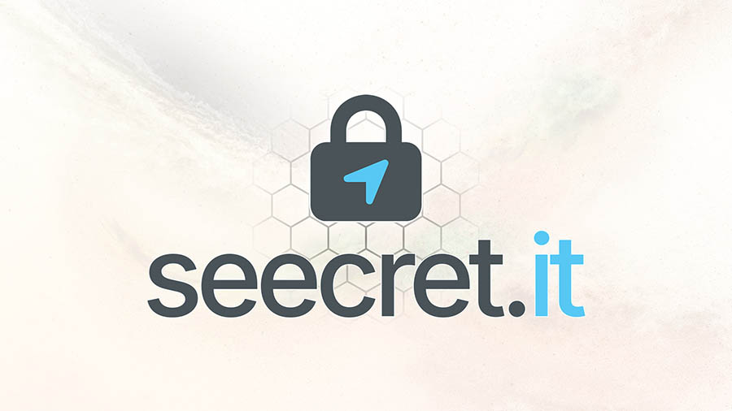

  

<h1>📦 Seecret.it — Partage sécurisé par lien à usage unique</h1>

Seecret.it est un service en ligne permettant de partager mots de passe, documents ou informations sensibles via des liens chiffrés et à usage unique. Votre donnée reste invisible, sécurisée, et s’autodétruit après consultation. Idéal pour les équipes IT, les entreprises, les indépendants et toute personne souhaitant transmettre des informations en toute confidentialité.

<h1>🔐 Fonctionnalités principales</h1>

Chiffrement côté serveur et suppression automatique après lecture

Liens à usage unique ou à durée personnalisée

Partage sécurisé de mots de passe, notes, messages ou fichiers

Protection optionnelle par mot de passe secondaire

Statistiques d’accès (date, IP, navigateur, pays — si activé)

Page dédiée pour générer des QR Codes Wi-Fi

Générateur de mots de passe intégré

API simple permettant d’envoyer du texte et récupérer un lien unique

Extensions et outils en cours de développement (Thunderbird, navigateur, etc.)

<h1>🚀 Pourquoi utiliser Seecret.it ?</h1>

L’envoi de mots de passe par email, SMS ou messagerie expose vos données.
Avec Seecret.it, aucune information sensible ne transite dans vos messages :
un simple lien unique, qui se détruit après usage.

Votre confidentialité, en un clic.

🛠️ Intégrations & outils
🔗 API (exemples d'utilisation)
POST https://seecret.it/api/create

Paramètres possibles :

content : texte chiffré

ttl : durée de vie (en secondes)

password : protection optionnelle

Un guide complet sera proposé prochainement.

📸 Fonctionnalités annexes

🔹 Générateur de QR Code Wi-Fi :
https://seecret.it/fr/qrcode_wifi

🔹 Générateur de mots de passe :
https://seecret.it/fr/password-generator
🧭 Liens utiles

🌐 Site officiel : https://seecret.it

📄 Conditions générales : https://seecret.it/fr/cgv

🔐 Politique de confidentialité : https://seecret.it/fr/privacy-policy

📰 Blog & SEO : https://seecret.it/fr/blog

<h1>🏷️ Mots-clés</h1>

security · password-sharing · encrypted-links · privacy · cybersecurity · qrcode-wifi · saas · confidentiality · secure-messaging

<h1>🧑‍💻 À propos</h1>

Développé pour simplifier le partage de données sensibles et améliorer les pratiques de sécurité au quotidien.
Seecret.it évolue constamment — de nouvelles intégrations et fonctionnalités arrivent régulièrement.
